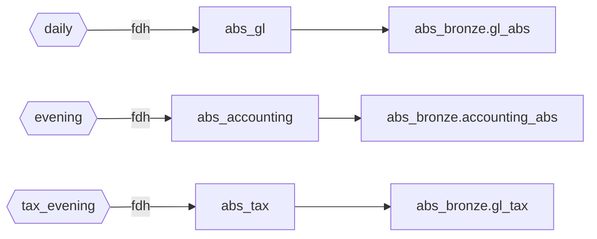

# Source ingestion map

Generated by `lakeflow-framework generate`. Do not edit; change `source.yaml` or a table
spec and regenerate. `./run.sh bundle:validate` regenerates it first.

## Requested by

| Team or project | Tables | Source systems |
| --- | --- | --- |
| fdh | 3 | abs |

## finance / abs

Kind: sftp_files. Owner: sonia.rajeev@allianz.com.au.
Raw schema: `abs_raw`. Files land in a volume here as delivered, and bronze reads them from it. Each table names its volume.

| Delivery | When |
| --- | --- |
| daily | cron `0 0 2 * * ?` |
| evening | cron `0 0 18 * * ?` |
| tax_evening | cron `0 0 18 * * ?` |

| Table | Delivery | Requested by | Reads | Load | Bronze | Technical owner |
| --- | --- | --- | --- | --- | --- | --- |
| abs_accounting | evening | fdh | volume abs_raw.finance_source_extract/ (csv) | volume_files | abs_bronze.accounting_abs | nitinkeshav.bolla@allianz.com.au |
| abs_gl | daily | fdh | volume abs_raw.gl_source_extract/ (csv) | volume_files | abs_bronze.gl_abs | nitinkeshav.bolla@allianz.com.au |
| abs_tax | tax_evening | fdh | volume abs_raw.tax_source_extract/ (csv) | volume_files | abs_bronze.gl_tax | nitinkeshav.bolla@allianz.com.au |

```mermaid
flowchart LR
  abs_daily{{daily}}
  abs_evening{{evening}}
  abs_tax_evening{{tax_evening}}
  abs_evening -->|fdh| abs_accounting[abs_accounting]
  abs_accounting --> abs_bronze_accounting_abs[abs_bronze.accounting_abs]
  abs_daily -->|fdh| abs_gl[abs_gl]
  abs_gl --> abs_bronze_gl_abs[abs_bronze.gl_abs]
  abs_tax_evening -->|fdh| abs_tax[abs_tax]
  abs_tax --> abs_bronze_gl_tax[abs_bronze.gl_tax]
```
